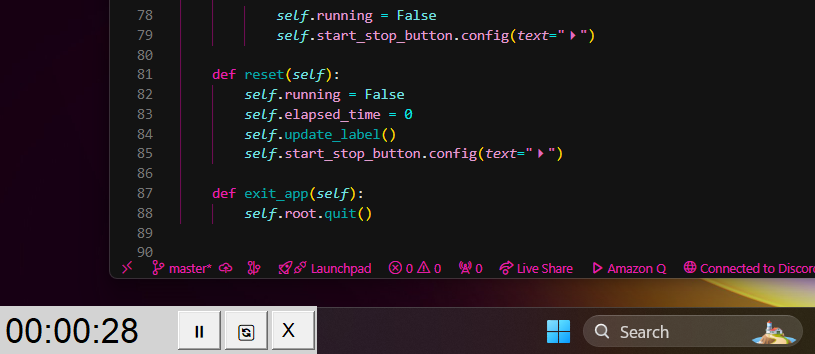

# mint

Minimalist chrometer app written with Python & Tkinter.

I was using the default Windows Clock app for an always on top chronometer but it was not great and i didnt like the size of it. So I have created this litle thing. I also plan on making the app look a lot better. But this works for now.

# screenshots

I like to place Mint on top of the Windows bar.

