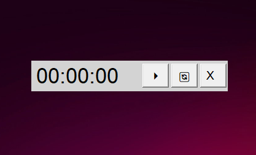
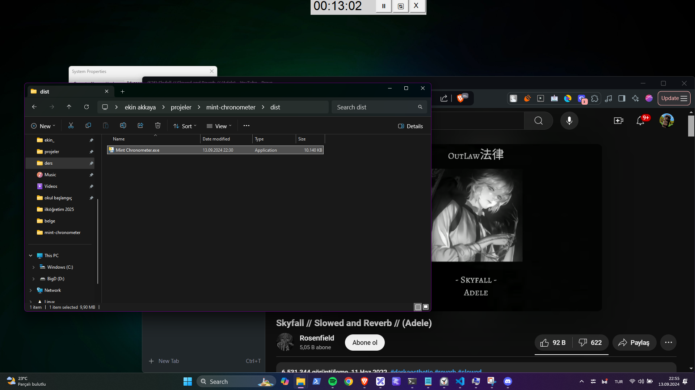

# mint

Minimalist chrometer app written with Python & Tkinter.

I was using the default Windows Clock app for an always on top chronometer but it was not great and i didnt like the size of it. So I have created this litle thing. I also plan on making the app look a lot better. But this works for now.

# install

Mint only works on Windows. You can download the binary file from the [latest release](https://github.com/user-attachments/files/16998899/Mint.Chronometer.zip) or just build it yourself from the source code like this:

```
git clone https://github.com/ekinakkaya/mint-chronometer.git
cd mint-chronometer

pip install pyinstaller
pyinstaller --noconsole --onefile --name "Mint Chronometer" mint.py
```

# screenshots



I like to place Mint on top middle part of the screen.


